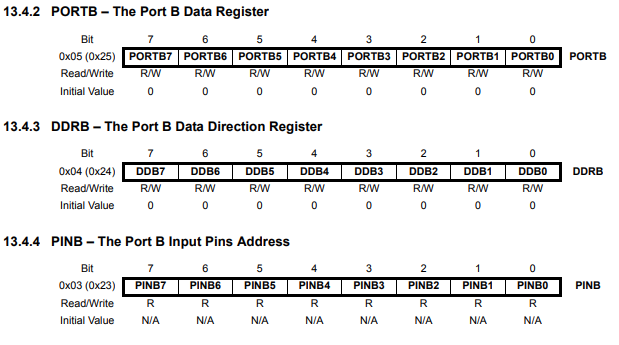

# Arduino Uno Board Pinout


# AVR Port B Registers



> PortB includes Digital pins 8 to 13.

- DDRB: Data Direction Register B
  - Determines whether the pin is an input or output.
- PORTB: Port B Data Register
  - If the pin is an output, the value of the register determines whether the pin is high or low.
- PINB: Port B Input Pins Address
  - If the pin is an input, PINB address can be used to read the value of the pin.

# Implementation

[BLINK.ino](BLINK/BLINK.ino)

```c
int main() {
  //Data Direction Register for Port B
  DDRB |= (1 << PB5);
  DDRB |= (1 << PB4);
  //Set PB4 & PB5 as Outputs
  while (1) {
    //PB4 is Digital pin 12
    //PB5 is Built In LED
    PORTB |= (1 << PB4);//Digital Pin 12 turn on
    PORTB |= (1 << PB5);//Built In LED turn on
    _delay_ms(1000);
    PORTB &= ~(1 << PB4);//Digital Pin 12 turn off
    PORTB &= ~(1 << PB5);//Built In LED turn off
    _delay_ms(1000);
  }
  return 0;
}
```

# Result


