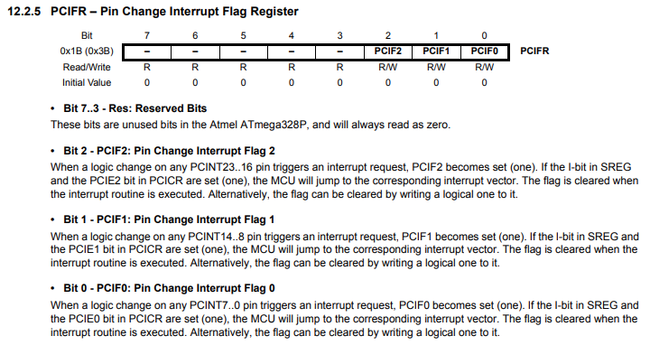
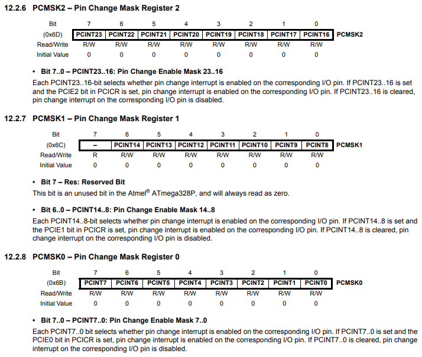

> Setup: <br>
> LED connected to Digital Pin 12.
> PullDown Button connected to Digital Pin 2.

## External Interrupts Registers

PCICR - Pin Change Interrupt Control Register


PCIFR - Pin Change Interrupt Flag Register



PCMSKx - Pin Change Mask Register x



# Implementation

Uses Pin Change Interrupt from PORTD Pin 2 to toggle the LED on Pin 12 of PORTB, and Timer1 Overflow Interrupt to toggle the Built-in LED on Pin 13 of PORTB.

This is non-blocking code. When the button is hit, the LED on Pin 12 toggles, and the LED on Pin 13 toggles every 1/2 second without any additional delay.

```c
#define F_CPU 16000000UL //Unsigned Long

#include <avr/io.h>
#include <avr/interrupt.h>
#include <util/delay.h>

ISR(PCINT2_vect) // Pin Change Interrupt 2
{
    _delay_ms(10); // Debounce
    if(PIND & _BV(PD2)) // If pin 2 of PORTD is high
        PORTB ^= _BV(PB4); // Toggle pin 13 of PORTB high
    PCIFR |= _BV(PCIF2); // Clear any outstanding interrupts
}

ISR(TIMER1_OVF_vect) // Timer1 overflow interrupt service routine
{
  PORTB ^= _BV(PB5); // Toggle the LED Pin 13 BUILDIN-LED
  TCNT1 = 65535 - (F_CPU/1024)/2; // Reset Timer1
}

int main() {
    DDRB |= _BV(PB5); // Set pin 13 of PORTB for output
    DDRB |= _BV(PB4); // Set pin 12 of PORTB for output
    DDRD &= ~_BV(PD2); // Set pin 2 of PORTD for input
    // PIND & (1 << PD2) -- PCINT18

// Pin Change Interrupt Setup
    PCIFR |= _BV(PCIF2); // Clear any outstanding interrupts

    PCICR |= _BV(PCIE2); // Enable
    PCMSK2 |= _BV(PCINT18); // Enable PCINT18 to trigger interrupt

// Timer Interrupt Setup
    TCNT1 = 65535 - (F_CPU/1024)/2; // Set timer to 0 | max 65535
    //Takes 1/2 second to overflow
    //16mhz/1024 = 15625 (clock rate per second)
    TCCR1B = (1 << CS12) | (1 << CS10); // Set up timer with prescaler = 1024
    TCCR1A = 0; // Set normal mode

    TIMSK1 |= (1 << TOIE1); // Enable overflow interrupt

    sei(); // Enable global interrupts
    while(1){
        ;;
    }

    return 0;
}
```

# Result


