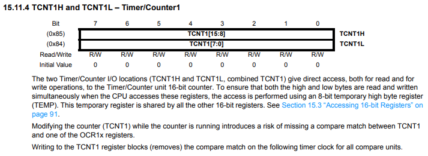
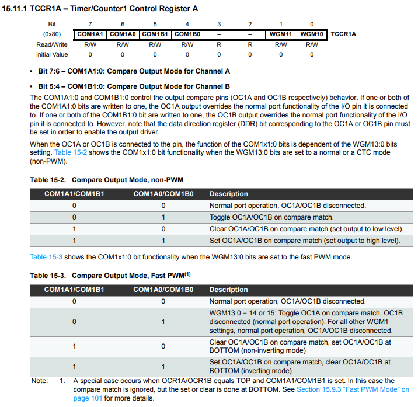
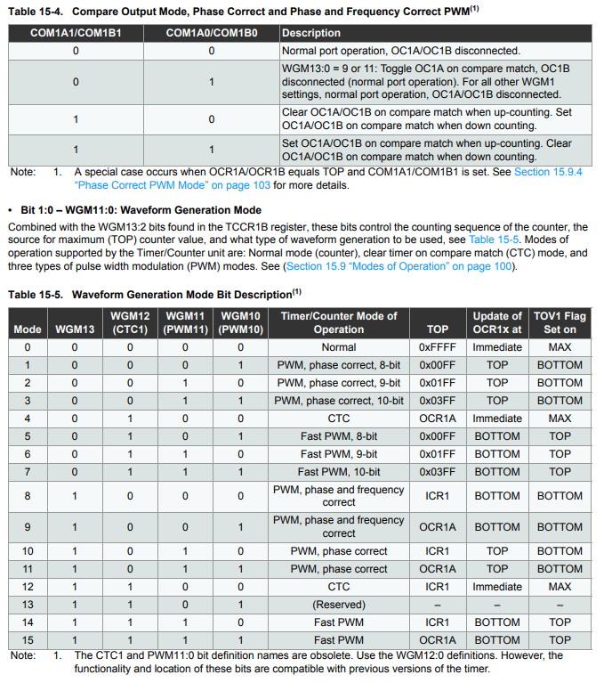
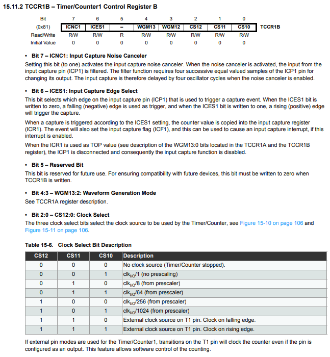
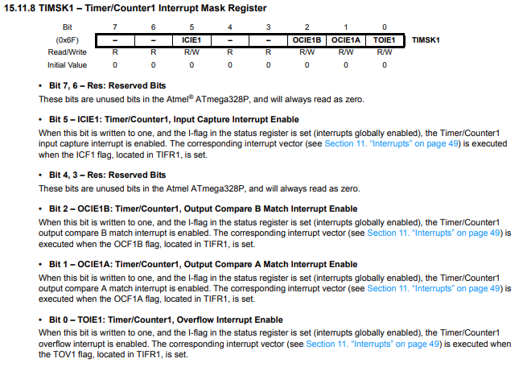

> Setup: <br>
> LED connected to Digital Pin 13 (parallel with built-in LED)

## Timer Registers

Page 108-113 datasheet

### TCNT1 - Timer/Counter1

16 bit counter. Max count value is 65536-1.



### TCCR1A - Timer/Counter1 Control Register A

We're not using PWM, so we dont need to worry about any of the COM or WGM bits. We can set the register to zero for normal operation.




### TCCR1B - Timer/Counter1 Control Register B

Want to set the prescaler to 1024. Looking at Table 15-6, we need to set the CS12 and CS10 bits to 1.

> 16Mhz / 1024 = 15625



### TIMSK1 - Timer/Counter1 Interrupt Mask Register

Want to create an interrupt when the timer overflows. We need to set the TOIE1 bit to 1. The corresponding interrupt vector `TIMER1_OVF_vect` is executed when the interrupt is triggered.



## Implementation

```c
#define F_CPU 16000000UL //Unsigned Long

#include <avr/io.h>
#include <avr/interrupt.h>
#include <avr/sleep.h>

ISR(TIMER1_OVF_vect) // Timer1 overflow interrupt service routine
{
  PORTB ^= _BV(PB5); // Toggle the LED Pin 13
  TCNT1 = 65535 - (F_CPU/1024)/2; // Reset Timer1
}

int main() {
  DDRB |= _BV(PB5); // Set pin 13 of PORTB for input

  TCNT1 = 65535 - (F_CPU/1024)/2; // Set timer to 0 | max 65535
/*
  WHY is the Timer Count = 65535 - (F_CPU/1024)/2 ?:
    16mhz/1024 = 15625 (clock rate per second)
      15625 is the amount that is counted in the timer per second.
      But since the counter has a max value of 65535, it will take 65535/15625 = 4.194 seconds to overflow if TCNT1 = 0.
      So we set the timer to 65535 - (15625) = 49911 to make it overflow in 1 second and trigger an interrupt.
      Similarly we can set it to 65535 - (15625/2) = 57723 to make it overflow in 1/2 second and trigger an interrupt.
*/
  TCCR1B = (1 << CS12) | (1 << CS10); // Set up timer with prescaler = 1024
  TCCR1A = 0; // Set normal mode

  TIMSK1 |= (1 << TOIE1); // Enable overflow interrupt
  sei(); // Enable global interrupts

  while(1){
    ;;
  }

  return 0;
}
```

## Result


