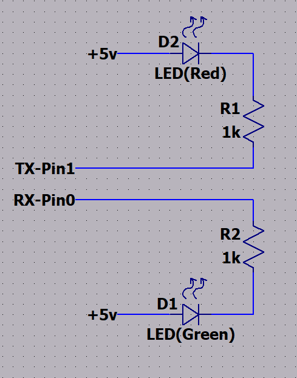
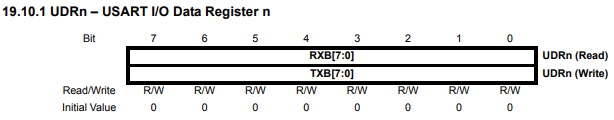
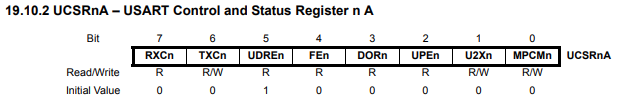
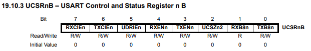
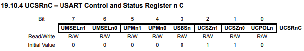
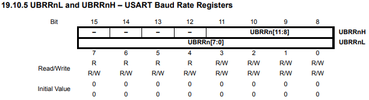

> Setup <br>
> Arduino is connected to a computer via USB. Run a serial terminal (like PuTTY) to connect to the arduino port and to interact with the program. <br>
>
> - Baud: 9600 <br>
> - Parity: None <br>
> - Data bits: 8 <br>
> - Stop bits: 1 <br>
> - Flow control: None <br>

### Arduino Circuit

I wanted to have larger LED's light up rather than the small on-board TX and RX LEDs



## USART0 Registers

### UDR0 - USART I/O Data Register

The USART data register is `UDR0`, containing 8 bits of data. This register can be used to both read and write data to the USART (i.e. for RX and TX). Data cannot be written to the `UDR0` register when the `UDRE0` flag is not set. The `UDRE0` flag is set when the `UDR0` register is empty and ready to be written to. The `UDRE0` flag is cleared when the `UDR0` register is full and cannot be written to. The `UDRE0` flag is located in the `UCSR0A` register.



### UCSR0A/B/C - USART Control and Status Registers



- **Bit 7** - RXC0: USART Receive Complete
  - This bit is set when there are unread data in the receive buffer and cleared when the receive buffer is empty (i.e. no unread data in the receive buffer).
- **Bit 6** - TXC0: USART Transmit Complete
  - This bit is set when the entire frame in the transmit shift register has been shifted out and there are no new data in the transmit buffer. This bit is cleared by hardware when the transmit complete interrupt is executed, or by writing a one to its bit location.
- **Bit 5** - UDRE0: USART Data Register Empty
  - This bit is set when the transmit buffer is empty and ready to be written to. This bit is cleared when the transmit buffer is full.
- **Bit 4** - FE0: Frame Error
  - This bit is set when the next frame in the receive buffer has a frame error. This bit is cleared by writing a one to its bit location.
- **Bit 3** - DOR0: Data OverRun
  - This bit is set when the receive buffer has been overrun by new incoming data. This bit is cleared by writing a one to its bit location.
- **Bit 2** - UPE0: USART Parity Error
  - This bit is set when the next frame in the receive buffer has a parity error. This bit is cleared by writing a one to its bit location.
- **Bit 1** - U2X0: Double the USART Transmission Speed
  - This bit only has effect for the asynchronous operation. Write this bit to zero when using synchronous operation. Writing this bit to one will reduce the divisor of the baud rate divider from 16 to 8 effectively doubling the transfer rate for asynchronous communication.
- **Bit 0** - MPCM0: Multi-processor Communication Mode
  - This bit is used in multi-processor communication mode. When the MPCM0 bit is written to one, the USART0 receiver will only accept frames that have a valid address in the Address Register (UCSR0A). Frames with a wrong address will be ignored by the receiver. The transmitter is unaffected by the MPCM0 setting.



- **Bit 7** - RXCIE0: RX Complete Interrupt Enable
  - When the RXCIE0 bit is written to one, the USART Receive Complete interrupt will be enabled. The RXC0 bit in the UCSR0A register will trigger this interrupt.
- **Bit 6** - TXCIE0: TX Complete Interrupt Enable
  - When the TXCIE0 bit is written to one, the USART Transmit Complete interrupt will be enabled. The TXC0 bit in the UCSR0A register will trigger this interrupt.
- **Bit 5** - UDRIE0: USART Data Register Empty Interrupt Enable
  - When the UDRIE0 bit is written to one, the USART Data Register Empty interrupt will be enabled. The UDRE0 bit in the UCSR0A register will trigger this interrupt.
- **Bit 4** - RXEN0: Receiver Enable
  - When the RXEN0 bit is written to one, the USART receiver is enabled. The receiver will override normal port operation for the RxD0 pin when enabled. Disabling the receiver will flush the receive buffer invalidating the FE0, DOR0, and PE0 flags.
- **Bit 3** - TXEN0: Transmitter Enable
  - When the TXEN0 bit is written to one, the USART transmitter is enabled. The transmitter will override normal port operation for the TxD0 pin when enabled. Disabling the transmitter will flush the transmit buffer.
- **Bit 2** - UCSZ02: Character Size
  - The UCSZ02 bit combined with the UCSZ01 and UCSZ00 bits in UCSR0C sets the number of data bits (character size) in a frame the receiver and transmitter use.
- **Bit 1** - RXB80: Receive Data Bit 8
  - This bit is the ninth bit of the received data when operating with serial frames with nine data bits. When operating with frames with fewer than nine data bits, this bit is read as zero.
- **Bit 0** - TXB80: Transmit Data Bit 8
  - This bit is the ninth bit of the data to be transmitted when operating with serial frames with nine data bits. When operating with frames with fewer than nine data bits, this bit is ignored.



- **Bit 7-6** - UMSEL01/00: USART Mode Select
  - The UMSEL01 and UMSEL00 bits combined with the UCPOL0 bit in UCSR0C sets the mode of operation for the USART.
    |UMSEL01|UMSEL00|Mode|
    |---|---|---|
    |0|0|Asynchronous USART|
    |0|1|Synchronous USART|
    |1|0|Reserved|
    |1|1|Master SPI|
- **Bit 5-4** - UPM01/00: Parity Mode
  - The UPM01 and UPM00 bits combined with the UCSZ02 bit in UCSR0B sets the parity mode.
    |UPM01|UPM00|Parity Mode|
    |---|---|---|
    |0|0|Disabled|
    |0|1|Reserved|
    |1|0|Even Parity|
    |1|1|Odd Parity|
- **Bit 3** - USBS0: Stop Bit Select
  - This bit selects the number of stop bits to be inserted by the transmitter. The receiver ignores this setting.
    |USBS0|Stop Bit(s)|
    |---|---|
    |0|1-bit|
    |1|2-bit|
- **Bit 2-1** - UCSZ01/00: Character Size
  - The UCSZ01 and UCSZ00 bits combined with the UCSZ02 bit in UCSR0B sets the number of data bits (character size) in a frame the receiver and transmitter use.
    |UCSZ02|UCSZ01|UCSZ00|Character Size|
    |---|---|---|---|
    |0|0|0|5-bit|
    |0|0|1|6-bit|
    |0|1|0|7-bit|
    |0|1|1|8-bit|
    |1|0|0|Reserved|
    |1|0|1|Reserved|
    |1|1|0|Reserved|
    |1|1|1|9-bit|
- **Bit 0** - UCPOL0: Clock Polarity
  - This bit is used for synchronous operation. When the UCPOL0 bit is written to zero, the XCK0 pin will be driven low when the transmitter is idle. When the UCPOL0 bit is written to one, the XCK0 pin will be driven high when the transmitter is idle.
    |UCPOL0|Transmitted Data Changed|Received Data Sampled|
    |---|---|---|
    |0|Rising XCK0|Falling XCK0|
    |1|Falling XCK0|Rising XCK0|

### UBRR0H/L - USART Baud Rate Registers



- **Bit 15-12** - Reserved bits
- **Bit 11-0** - UBRR0[11:0]: USART Baud Rate Register
  - The UBRR0H and UBRR0L registers combined to set the USART baud rate. The UBRR0H contains the four most significant bits and the UBRR0L contains the eight least significant bits of the USART baud rate. The baud rate is calculated using the formula:
    > `Baud Rate = fosc / (16 * (UBRR0 + 1))`
    >
    > Where:
    >
    > - `fosc` is the frequency of the system clock
    > - `UBRR0` is the value of the UBRR0H and UBRR0L registers
    >   <br><br>
    >
    > To find the value of `UBRR0`:
    >
    > `UBRR0 = (fosc / (16 * Baud Rate)) - 1`

## Implementation

In my implementation I used the Data Register Empty Interrupt to sense when the Data Register was empty, after reading the recieved data from the Data Register. This allowed me to start transmitting the data immediately after it was recieved (once the data register was read and emptied).

```c
#define F_CPU 16000000UL

#include <avr/io.h>
#include <avr/interrupt.h>
#include <util/delay.h>
#include "string.h"

typedef enum {false, true} bool;

#define BAUD 9600
#define BRC ((F_CPU/16/BAUD)-1)//Baudrate Register Calculation

volatile char received_char = '\0';
volatile bool transmit = false;

#define BUFFER_SIZE 128 //Buffer overflow can occur if input is more than 8 characters
uint8_t serial_buffer[BUFFER_SIZE];
volatile uint16_t serialreadpos = 0;
volatile uint16_t serialwritepos = 0;


void appendSerial(char c){
    //Add the character to the buffer
    serial_buffer[serialwritepos] = c;
    serialwritepos++;
    if(serialwritepos >= BUFFER_SIZE){
        serialwritepos = 0;
    }
    transmit = true;
    UCSR0A |= (1<<UDRE0);//Enable the data register empty flag to call the ISR
    //Essentially calls the ISR everytime a character is added to the buffer, so the ISR can start transmitting the data in the buffer immediately
}

void serialWrite(char c[]){
    for(int i=0; i < strlen(c); i++){
        //Add each character to the buffer
        appendSerial(c[i]);
    }
}

int main(){
    //Set the baud rate registers
    UBRR0H = (BRC >> 8);
    UBRR0L = BRC;
    //Enable the transmitter and receiver and their interrupts
    UCSR0B |= (1 << TXEN0) | (1 << TXCIE0);
    UCSR0B |= (1 << RXEN0) | (1 << RXCIE0);
    //Set the character size(8 bits) Frame Format:(the rest of the bits are 0 by default, so no need to change them)
    UCSR0C = (1 << UCSZ01) | (1 << UCSZ00);
    sei();//Enable global interrupts
    serialWrite("\r\nWelcome To My Echo Program:\r\n");
    while (1){
        if(transmit){
            UCSR0B |= (1<<UDRIE0);//Enable the data register empty interrupt
            //Doing this the first time will call the ISR
        }
        _delay_ms(10);
    }
    return 0;
}

ISR(USART_TX_vect){
    //Not Necessary
}
ISR(USART_RX_vect){
    //Handle the received data
    /*Whenever a character is recieved, it's read from the data register
    and then the appropriate response is added to the buffer to be transmitted*/
    received_char = UDR0; //Read the data register
    serialWrite("You entered: ");
    appendSerial(received_char);
    serialWrite("\r\n");
    //Start transmitting the data
    transmit = true;
}
ISR(USART_UDRE_vect){
    //Handle when the data register is empty after receiving(and ready to transmit data)
    //If there is data in the buffer and can transmit
    if(transmit && serialreadpos != serialwritepos){
        UDR0 = serial_buffer[serialreadpos];//Write the data to the register
        serialreadpos++;
        if(serialreadpos >= BUFFER_SIZE){
            //If the buffer is full, reset the position
            serialreadpos = 0;
        }
        if(serialreadpos == serialwritepos){
            //If the buffer is empty, stop transmitting
            transmit = false;
        }
    }
    else{
        //If done transmitting, reset the data register empty flag to 0 (the ISR is called when this is flipped to 1 again)
        UCSR0A &= ~(1<<UDRE0);
    }
}
```

## Result

To start a serial connection with the arduino, run the following command in the terminal:

```
sudo putty /dev/ttyACM0 -serial -sercfg 9600,8,n,1,N
```

> I used MobaXTerm instead in the result below
>
> Green LED: RX <br>
> Red LED: TX


